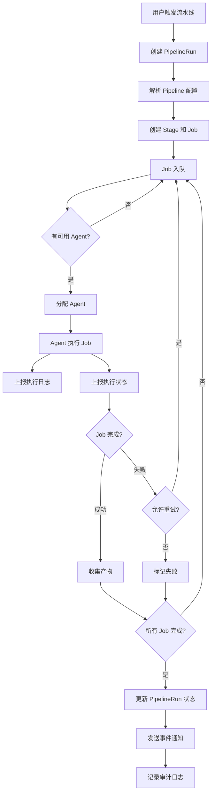
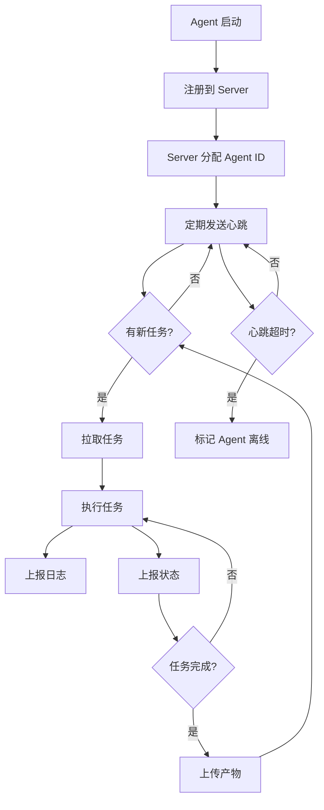
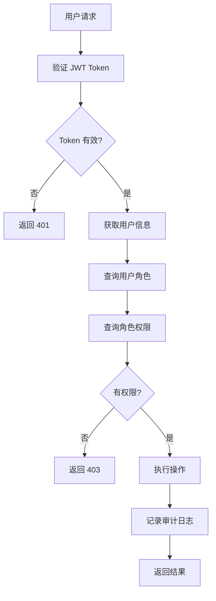
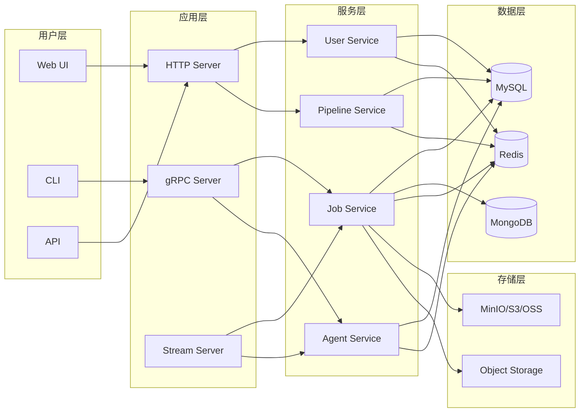

# Arcade CI/CD 平台 ER 图

## 完整数据库关系图

```mermaid
erDiagram
    %% 用户和权限模块
    t_user ||--o{ t_role_relation : "has"
    t_role ||--o{ t_role_relation : "has"
    t_user_group ||--o{ t_role_relation : "has"
    t_user ||--o{ t_pipeline : "creates"
    t_user ||--o{ t_pipeline_run : "triggers"
    t_user ||--o{ t_job : "creates"
    t_user ||--o{ t_secret : "creates"
    t_user ||--o{ t_audit_log : "performs"
    
    %% 流水线和任务模块
    t_pipeline ||--o{ t_pipeline_run : "has"
    t_pipeline ||--o{ t_pipeline_stage : "contains"
    t_pipeline_run ||--o{ t_job : "contains"
    t_pipeline_stage ||--o{ t_job : "contains"
    t_job ||--o{ t_job_artifact : "produces"
    t_job }o--|| t_agent : "executes_on"
    
    %% 事件和日志模块
    t_system_event }o--|| t_user : "triggered_by"
    t_job ||--o{ t_system_event : "generates"
    t_pipeline_run ||--o{ t_system_event : "generates"
    t_agent ||--o{ t_system_event : "generates"

    %% 用户表
    t_user {
        int id PK
        varchar user_id UK
        varchar username UK
        varchar nick_name
        varchar password
        varchar avatar
        varchar email UK
        varchar phone
        tinyint is_enabled
        datetime create_time
        datetime update_time
    }

    %% 角色表
    t_role {
        int id PK
        varchar role_id UK
        varchar role_name
        varchar role_code UK
        varchar role_desc
        datetime create_time
        datetime update_time
    }

    %% 用户组表
    t_user_group {
        int id PK
        varchar group_id UK
        varchar group_name UK
        varchar group_desc
        datetime create_time
        datetime update_time
    }

    %% 角色关系表
    t_role_relation {
        int id PK
        varchar role_id FK
        varchar user_id FK
        varchar group_id FK
        datetime create_time
        datetime update_time
    }

    %% SSO认证提供者表
    t_sso_provider {
        int id PK
        varchar provider_id UK
        varchar name
        varchar provider_type
        json config
        varchar description
        int priority
        tinyint is_enabled
        datetime create_time
        datetime update_time
    }

    %% Agent表
    t_agent {
        int id PK
        varchar agent_id UK
        varchar agent_name
        varchar hostname
        varchar address
        varchar port
        varchar username
        tinyint auth_type
        varchar os
        varchar arch
        varchar version
        tinyint status
        int max_concurrent_jobs
        int running_jobs_count
        json labels
        json metrics
        datetime last_heartbeat
        tinyint is_enabled
        datetime create_time
        datetime update_time
    }

    %% 流水线定义表
    t_pipeline {
        int id PK
        varchar pipeline_id UK
        varchar name
        text description
        varchar repo_url
        varchar branch
        tinyint status
        tinyint trigger_type
        varchar cron
        json env
        int total_runs
        int success_runs
        int failed_runs
        varchar created_by FK
        tinyint is_enabled
        datetime create_time
        datetime update_time
    }

    %% 流水线执行记录表
    t_pipeline_run {
        int id PK
        varchar run_id UK
        varchar pipeline_id FK
        varchar pipeline_name
        varchar branch
        varchar commit_sha
        tinyint status
        tinyint trigger_type
        varchar triggered_by FK
        json env
        int total_jobs
        int completed_jobs
        int failed_jobs
        int running_jobs
        int current_stage
        int total_stages
        datetime start_time
        datetime end_time
        bigint duration
        datetime create_time
        datetime update_time
    }

    %% 流水线阶段表
    t_pipeline_stage {
        int id PK
        varchar stage_id UK
        varchar pipeline_id FK
        varchar name
        int stage_order
        tinyint parallel
        datetime create_time
        datetime update_time
    }

    %% 任务表
    t_job {
        int id PK
        varchar job_id UK
        varchar name
        varchar pipeline_id FK
        varchar pipeline_run_id FK
        varchar stage_id FK
        int stage
        varchar agent_id FK
        tinyint status
        int priority
        varchar image
        text commands
        varchar workspace
        json env
        json secrets
        int timeout
        int retry_count
        int current_retry
        tinyint allow_failure
        json label_selector
        varchar depends_on
        int exit_code
        text error_message
        datetime start_time
        datetime end_time
        bigint duration
        varchar created_by FK
        datetime create_time
        datetime update_time
    }

    %% 任务产物表
    t_job_artifact {
        int id PK
        varchar artifact_id UK
        varchar job_id FK
        varchar pipeline_run_id FK
        varchar name
        varchar path
        varchar destination
        bigint size
        varchar storage_type
        varchar storage_path
        tinyint expire
        int expire_days
        datetime expired_at
        datetime create_time
        datetime update_time
    }

    %% 系统事件表
    t_system_event {
        bigint id PK
        varchar event_id UK
        tinyint event_type
        varchar resource_type
        varchar resource_id
        varchar resource_name
        text message
        json metadata
        varchar user_id FK
        datetime create_time
    }

    %% 对象存储配置表
    t_storage_config {
        int id PK
        varchar storage_id UK
        varchar name
        varchar storage_type
        json config
        varchar description
        tinyint is_default
        tinyint is_enabled
        datetime create_time
        datetime update_time
    }

    %% 系统配置表
    t_system_config {
        int id PK
        varchar config_key UK
        text config_value
        varchar config_type
        varchar description
        tinyint is_encrypted
        datetime create_time
        datetime update_time
    }

    %% 密钥管理表
    t_secret {
        int id PK
        varchar secret_id UK
        varchar name
        varchar secret_type
        text secret_value
        varchar description
        varchar scope
        varchar scope_id
        varchar created_by FK
        datetime create_time
        datetime update_time
    }

    %% 操作审计日志表
    t_audit_log {
        bigint id PK
        varchar user_id FK
        varchar username
        varchar action
        varchar resource_type
        varchar resource_id
        varchar resource_name
        varchar ip_address
        varchar user_agent
        json request_params
        int response_status
        text error_message
        datetime create_time
    }
```



## 核心业务流程图

### 1. 流水线执行流程



### 2. Agent 管理流程



### 3. 权限验证流程



## 数据流向图



## 索引设计总结

### 主要索引类型
1. **主键索引 (PRIMARY KEY)**: 所有表的 `id` 字段
2. **唯一索引 (UNIQUE)**: 业务主键字段（`user_id`, `job_id`, `pipeline_id` 等）
3. **普通索引 (INDEX)**: 高频查询字段（`status`, `create_time`, 外键等）
4. **复合索引 (COMPOSITE)**: 多字段组合查询

### 建议的复合索引

```sql
-- Job 表
CREATE INDEX idx_job_pipeline_status ON t_job(pipeline_id, status, start_time);
CREATE INDEX idx_job_agent_status ON t_job(agent_id, status);

-- Pipeline Run 表
CREATE INDEX idx_run_pipeline_status ON t_pipeline_run(pipeline_id, status, start_time);

-- System Event 表
CREATE INDEX idx_event_resource ON t_system_event(resource_type, resource_id, create_time);

-- Audit Log 表
CREATE INDEX idx_audit_user_action ON t_audit_log(user_id, action, create_time);
```

## 数据量预估

基于中等规模使用场景（100个流水线，每天1000次执行）：

| 表名 | 日增量 | 月增量 | 年增量 | 单条大小 | 存储增长/年 |
|------|--------|--------|--------|----------|-------------|
| t_user | 10 | 300 | 3.6K | 500B | 1.8MB |
| t_pipeline | 5 | 150 | 1.8K | 1KB | 1.8MB |
| t_pipeline_run | 1000 | 30K | 360K | 500B | 180MB |
| t_job | 5000 | 150K | 1.8M | 1KB | 1.8GB |
| t_job_artifact | 2000 | 60K | 720K | 500B | 360MB |
| t_system_event | 10000 | 300K | 3.6M | 300B | 1.08GB |
| t_audit_log | 5000 | 150K | 1.8M | 500B | 900MB |
| t_storage_config | 5 | - | - | 1KB | 5KB |
| job_logs (MongoDB) | 500万行 | 1.5亿行 | 18亿行 | 200B | 360GB |

**总存储预估**: 约 **365GB/年** (包括索引约 **500GB/年**)

**注**: t_storage_config 为配置表，数据量极小，增长缓慢。

