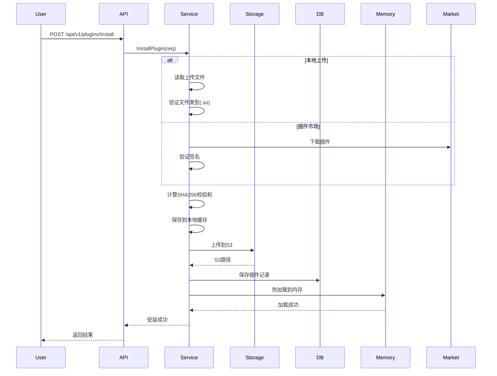
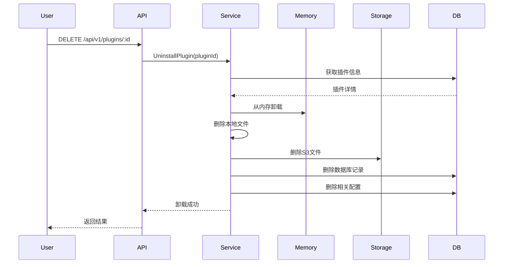

# 插件系统重构文档

## 概述

本文档描述了 Arcade 插件系统的重构设计，旨在提供完整的插件生命周期管理能力，包括安装、卸载、启用、禁用和热更新功能。

## 架构设计

### 系统架构图

```
┌─────────────────────────────────────────────────────────────┐
│                      前端/客户端                              │
│              (Web UI / CLI / API Client)                     │
└────────────────────────┬────────────────────────────────────┘
                         │ HTTP/gRPC
                         ▼
┌─────────────────────────────────────────────────────────────┐
│                      API Layer                               │
│  ┌──────────────────────────────────────────────────────┐  │
│  │            Plugin Router (HTTP API)                   │  │
│  │  - POST   /api/v1/plugins/install                    │  │
│  │  - DELETE /api/v1/plugins/:id                        │  │
│  │  - POST   /api/v1/plugins/:id/enable                 │  │
│  │  - POST   /api/v1/plugins/:id/disable                │  │
│  │  - GET    /api/v1/plugins                            │  │
│  └──────────────────────────────────────────────────────┘  │
└────────────────────────┬────────────────────────────────────┘
                         │
                         ▼
┌─────────────────────────────────────────────────────────────┐
│                   Service Layer                              │
│  ┌──────────────────────────────────────────────────────┐  │
│  │           Plugin Service                              │  │
│  │  - InstallPlugin()    安装插件                        │  │
│  │  - UninstallPlugin()  卸载插件                        │  │
│  │  - EnablePlugin()     启用插件                        │  │
│  │  - DisablePlugin()    禁用插件                        │  │
│  │  - UpdatePlugin()     更新插件                        │  │
│  │  - ListPlugins()      列出插件                        │  │
│  └──────────────────────────────────────────────────────┘  │
└─────┬──────────────┬──────────────┬─────────────────────────┘
      │              │              │
      ▼              ▼              ▼
┌──────────┐  ┌──────────┐  ┌─────────────┐
│ Database │  │ Storage  │  │   Memory    │
│  (MySQL) │  │  (S3)    │  │  (Plugin    │
│          │  │          │  │  Manager)   │
└──────────┘  └──────────┘  └─────────────┘
```

### 核心组件

#### 1. Plugin Service (`service_plugin.go`)

插件管理服务，负责插件的核心业务逻辑。

**主要功能：**
- 插件安装（从本地或插件市场）
- 插件卸载（清理所有相关资源）
- 插件启用/禁用
- 插件版本更新
- 热加载到内存

**关键方法：**

```go
type PluginService struct {
    ctx             *ctx.Context
    pluginRepo      *repo.PluginRepo
    pluginManager   *plugin.Manager
    storageProvider storage.StorageProvider
    localCacheDir   string
}

// 安装插件
func (s *PluginService) InstallPlugin(req *InstallPluginRequest) (*InstallPluginResponse, error)

// 卸载插件
func (s *PluginService) UninstallPlugin(pluginID string) error

// 启用插件
func (s *PluginService) EnablePlugin(pluginID string) error

// 禁用插件
func (s *PluginService) DisablePlugin(pluginID string) error

// 更新插件
func (s *PluginService) UpdatePlugin(pluginID string, req *InstallPluginRequest) (*InstallPluginResponse, error)

// 热加载插件
func (s *PluginService) hotReloadPlugin(pluginID, localPath string, defaultConfig json.RawMessage) error
```

#### 2. Plugin Router (`router_plugin.go`)

提供 RESTful API 接口。

**API 端点：**

| 方法 | 路径 | 描述 |
|-----|------|------|
| GET | `/api/v1/plugins` | 列出所有插件 |
| GET | `/api/v1/plugins/:pluginId` | 获取插件详情 |
| POST | `/api/v1/plugins/install` | 安装插件 |
| DELETE | `/api/v1/plugins/:pluginId` | 卸载插件 |
| POST | `/api/v1/plugins/:pluginId/enable` | 启用插件 |
| POST | `/api/v1/plugins/:pluginId/disable` | 禁用插件 |
| PUT | `/api/v1/plugins/:pluginId` | 更新插件 |
| GET | `/api/v1/plugins/metrics` | 获取插件运行指标 |
| POST | `/api/v1/plugins/validate-manifest` | 验证插件清单 |

#### 3. Plugin Repository (`repo_plugin.go`)

数据访问层，处理数据库操作。

**新增方法：**
- `CreatePlugin()` - 创建插件记录
- `UpdatePlugin()` - 更新插件信息
- `DeletePlugin()` - 删除插件记录
- `UpdatePluginStatus()` - 更新插件状态
- `ListPlugins()` - 列出插件（支持过滤）
- `DeletePluginConfigs()` - 删除插件配置

#### 4. Plugin Model (`model_plugin.go`)

数据模型定义，新增字段：

```go
type Plugin struct {
    BaseModel
    PluginId      string        // 插件ID
    Name          string        // 插件名称
    Version       string        // 版本号
    Description   string        // 描述
    Author        string        // 作者
    PluginType    string        // 插件类型
    EntryPoint    string        // 入口点
    ConfigSchema  datatype.JSON // 配置Schema
    ParamsSchema  datatype.JSON // 参数Schema
    DefaultConfig datatype.JSON // 默认配置
    Icon          string        // 图标
    Repository    string        // 仓库地址
    Documentation string        // 文档
    IsEnabled     int           // 状态: 0-禁用 1-启用 2-错误
    IsBuiltin     int           // 是否内置（保留字段，所有插件均为0）
    Checksum      string        // SHA256校验和
    Source        string        // NEW: 来源 (local/market)
    S3Path        string        // NEW: S3存储路径
    Manifest      datatype.JSON // NEW: 插件清单
    InstallTime   *string       // NEW: 安装时间
    UpdateTime    *string       // NEW: 更新时间
}
```

## 功能详解

### 1. 插件安装

#### 安装流程



#### 安装来源

**1. 本地上传（Local Upload）**

```bash
curl -X POST http://localhost:8080/api/v1/plugins/install \
  -F "source=local" \
  -F "file=@plugin.so" \
  -F 'manifest={
    "name": "my-plugin",
    "version": "1.0.0",
    "pluginType": "notify",
    "entryPoint": "plugin.so",
    "description": "My custom plugin"
  }'
```

**2. 插件市场（Plugin Market）**

```bash
curl -X POST http://localhost:8080/api/v1/plugins/install \
  -F "source=market" \
  -F "marketId=plugin-notify-slack" \
  -F 'manifest={
    "name": "slack-notify",
    "version": "1.0.0",
    "pluginType": "notify"
  }'
```

#### 资源清单（Manifest）

插件清单定义了插件的元数据和资源需求：

```json
{
  "name": "slack-notify",
  "version": "1.0.0",
  "description": "Slack notification plugin",
  "author": "Arcade Team",
  "homepage": "https://example.com",
  "repository": "https://github.com/example/slack-plugin",
  "pluginType": "notify",
  "entryPoint": "slack.so",
  "dependencies": [],
  "configSchema": {
    "type": "object",
    "properties": {
      "webhook_url": {
        "type": "string",
        "description": "Slack webhook URL"
      },
      "channel": {
        "type": "string",
        "description": "Slack channel"
      }
    },
    "required": ["webhook_url"]
  },
  "defaultConfig": {
    "channel": "#general"
  },
  "icon": "https://example.com/icon.png",
  "tags": ["notify", "slack", "communication"],
  "minVersion": "1.0.0",
  "resources": {
    "cpu": "100m",
    "memory": "128Mi",
    "disk": "50Mi"
  }
}
```

### 2. 插件卸载

#### 卸载流程



**注意事项：**
- 所有插件都可以被卸载（没有内置插件）
- 卸载会删除所有相关资源（本地文件、S3文件、数据库记录）
- 卸载前会先从内存中移除插件

### 3. 插件启用/禁用

#### 启用插件

```bash
curl -X POST http://localhost:8080/api/v1/plugins/:pluginId/enable
```

流程：
1. 更新数据库状态为"启用"
2. 从本地缓存加载插件
3. 热加载到内存
4. 初始化插件

#### 禁用插件

```bash
curl -X POST http://localhost:8080/api/v1/plugins/:pluginId/disable
```

流程：
1. 从内存中卸载插件
2. 更新数据库状态为"禁用"
3. 保留本地文件和S3文件

### 4. 热更新到内存

#### 热更新机制

插件系统支持热更新，无需重启服务即可加载或卸载插件。

**实现原理：**

```go
func (s *PluginService) hotReloadPlugin(pluginID, localPath string, defaultConfig json.RawMessage) error {
    // 1. 解析配置
    var config interface{}
    if len(defaultConfig) > 0 {
        json.Unmarshal(defaultConfig, &config)
    }
    
    // 2. 卸载旧插件（如果存在）
    _ = s.pluginManager.AntiRegister(pluginID)
    
    // 3. 注册新插件
    if err := s.pluginManager.Register(localPath, pluginID, config); err != nil {
        return err
    }
    
    // 4. 初始化插件
    ctx := context.Background()
    if err := s.pluginManager.Init(ctx); err != nil {
        return err
    }
    
    return nil
}
```

**限制：**
- Go 的 plugin 包不支持真正的卸载（.so 文件会一直占用内存）
- 热更新实际上是移除管理器中的引用
- 建议定期重启服务以释放内存

### 5. 存储架构

#### 三层存储

插件系统采用三层存储架构：

```
┌─────────────────────────────────────────────────────────┐
│                    1. 内存存储                           │
│              (Plugin Manager - 运行时)                   │
│  - 快速访问                                              │
│  - 热加载/热卸载                                         │
│  - 插件实例缓存                                          │
└─────────────────────────────────────────────────────────┘
                           ▲
                           │ 加载
                           │
┌─────────────────────────────────────────────────────────┐
│                    2. 本地缓存                           │
│              (Local File System)                         │
│  - 路径: /var/lib/arcade/plugins/                       │
│  - 格式: plugin_name_version.so                         │
│  - 快速重新加载                                          │
└─────────────────────────────────────────────────────────┘
                           ▲
                           │ 同步
                           │
┌─────────────────────────────────────────────────────────┐
│                    3. 对象存储                           │
│              (S3/MinIO/OSS/COS/GCS)                     │
│  - 路径: plugins/{plugin_id}/{version}/                 │
│  - 持久化存储                                            │
│  - 跨节点共享                                            │
│  - 备份和恢复                                            │
└─────────────────────────────────────────────────────────┘
```

#### 存储路径规范

**本地缓存路径（动态生成，不存储在数据库）：**
```
/var/lib/arcade/plugins/{plugin_id}_{version}.so
```

路径生成规则：
```go
func getLocalPath(pluginID, version string) string {
    filename := fmt.Sprintf("%s_%s.so", pluginID, version)
    return filepath.Join(localCacheDir, filename)
}
```

例如：
```
/var/lib/arcade/plugins/plugin_slack_abc123_1.0.0.so
```

**S3存储路径：**
```
plugins/{plugin_id}/{version}/{plugin_id}_{version}.so
```

例如：
```
plugins/plugin_slack_abc123/1.0.0/plugin_slack_abc123_1.0.0.so
```

**优势：**
- ✅ 路径统一管理，避免数据不一致
- ✅ 数据库更简洁，不存储冗余路径信息
- ✅ 便于批量管理和清理

### 6. 安全机制

#### 校验和验证

所有插件文件都会计算 SHA256 校验和：

```go
func (s *PluginService) calculateChecksum(data []byte) string {
    hash := sha256.Sum256(data)
    return hex.EncodeToString(hash[:])
}
```

**用途：**
1. 防止文件篡改
2. 验证下载完整性
3. 版本一致性检查

#### 权限控制

```go
// TODO: 实现权限检查
func (s *PluginDownloadService) CheckPluginPermission(agentID string, pluginID string) error {
    // 根据Agent的标签、组织、项目等进行权限判断
    return nil
}
```

建议实现：
- 基于角色的访问控制（RBAC）
- 插件市场签名验证
- 组织级插件隔离

## API 使用示例

### 1. 安装插件（本地上传）

**准备插件包：**

```bash
# 1. 创建 manifest.json
cat > manifest.json <<EOF
{
  "name": "my-notify-plugin",
  "version": "1.0.0",
  "description": "Custom notification plugin",
  "author": "Your Name",
  "pluginType": "notify",
  "entryPoint": "plugin.so",
  "configSchema": {
    "type": "object",
    "properties": {
      "api_key": {"type": "string"}
    }
  }
}
EOF

# 2. 编译插件
go build -buildmode=plugin -o plugin.so main.go

# 3. 打包为 zip
zip my-notify-plugin.zip plugin.so manifest.json
```

**上传安装：**

```bash
curl -X POST http://localhost:8080/api/v1/plugins/install \
  -F "source=local" \
  -F "file=@my-notify-plugin.zip"
```

### 2. 列出所有插件

```bash
# 列出所有插件
curl http://localhost:8080/api/v1/plugins

# 按类型过滤
curl http://localhost:8080/api/v1/plugins?pluginType=notify

# 按状态过滤
curl http://localhost:8080/api/v1/plugins?status=1
```

### 3. 获取插件详情

```bash
curl http://localhost:8080/api/v1/plugins/plugin_slack_abc123
```

### 4. 启用/禁用插件

```bash
# 启用插件
curl -X POST http://localhost:8080/api/v1/plugins/plugin_slack_abc123/enable

# 禁用插件
curl -X POST http://localhost:8080/api/v1/plugins/plugin_slack_abc123/disable
```

### 5. 卸载插件

```bash
curl -X DELETE http://localhost:8080/api/v1/plugins/plugin_slack_abc123
```

### 6. 更新插件

```bash
# 准备新版本 zip 包
zip my-notify-plugin-2.0.0.zip plugin.so manifest.json

# 更新插件
curl -X PUT http://localhost:8080/api/v1/plugins/plugin_slack_abc123 \
  -F "source=local" \
  -F "file=@my-notify-plugin-2.0.0.zip"
```

### 7. 获取插件运行指标

```bash
curl http://localhost:8080/api/v1/plugins/metrics
```

响应示例：
```json
[
  {
    "name": "slack-notify",
    "type": "notify",
    "version": "1.0.0",
    "path": "/var/lib/arcade/plugins/plugin_slack_abc123_1.0.0.so",
    "description": "Slack notification plugin"
  }
]
```

## 数据库迁移

### 新增字段

```sql
ALTER TABLE t_plugin 
ADD COLUMN source VARCHAR(20) DEFAULT 'local' COMMENT '插件来源: local/market',
ADD COLUMN s3_path VARCHAR(500) DEFAULT '' COMMENT 'S3存储路径',
ADD COLUMN manifest JSON DEFAULT NULL COMMENT '插件清单',
ADD COLUMN install_time DATETIME DEFAULT NULL COMMENT '安装时间',
ADD COLUMN update_time DATETIME DEFAULT NULL COMMENT '更新时间';

-- 更新现有插件的来源字段（所有插件都是下载安装的，没有内置插件）
UPDATE t_plugin SET source = 'local' WHERE (source IS NULL OR source = '');

-- 添加索引
CREATE INDEX idx_plugin_source ON t_plugin(source);
CREATE INDEX idx_plugin_status ON t_plugin(is_enabled);
```

## 配置说明

### 服务配置

```toml
[plugin]
# 本地缓存目录
local_cache_dir = "/var/lib/arcade/plugins"

# 是否启用插件市场
enable_market = true

# 插件市场API地址
market_api = "https://marketplace.arcade.io/api"

# 是否自动检查更新
auto_check_update = true

# 更新检查间隔（秒）
update_check_interval = 86400

# 插件加载超时（秒）
load_timeout = 30

# 最大插件大小（MB）
max_plugin_size = 100
```

## 监控和日志

### 日志输出

插件系统会输出详细的日志信息：

```
[INFO] [PluginService] installing plugin from source: local
[INFO] [PluginService] saved to local cache: /var/lib/arcade/plugins/plugin_slack_abc123_1.0.0.so
[INFO] [PluginService] uploaded to storage: plugins/plugin_slack_abc123/1.0.0/plugin_slack_abc123_1.0.0.so
[INFO] [PluginService] hot reloaded plugin: plugin_slack_abc123
[INFO] [PluginService] plugin installed successfully: plugin_slack_abc123 (v1.0.0)
```

### 监控指标

建议监控以下指标：
- 插件数量（总数、启用数、禁用数）
- 插件安装成功率
- 插件加载时间
- 插件错误率
- 内存占用
- S3存储使用量

## 最佳实践

### 1. 插件开发

- 遵循插件接口规范
- 提供完整的配置Schema
- 实现优雅的错误处理
- 添加详细的日志输出
- 包含完整的清单文件

### 2. 插件安装

- 先在测试环境验证
- 检查版本兼容性
- 备份现有配置
- 监控安装过程
- 验证插件功能

### 3. 插件管理

- 定期检查插件更新
- 及时卸载不需要的插件
- 保持插件版本一致
- 定期重启服务释放内存
- 监控插件性能

### 4. 安全建议

- 只从可信来源安装插件
- 验证插件签名
- 定期审计插件权限
- 监控异常行为
- 及时更新有漏洞的插件

## 未来计划

### 短期（1-3个月）

- [ ] 实现插件市场集成
- [ ] 添加插件签名验证
- [ ] 实现插件依赖管理
- [ ] 添加插件版本回滚功能
- [ ] 实现插件权限控制

### 中期（3-6个月）

- [ ] 构建插件开发SDK
- [ ] 提供插件开发模板
- [ ] 实现插件测试框架
- [ ] 添加插件性能分析工具
- [ ] 支持插件A/B测试

### 长期（6-12个月）

- [ ] 建立插件生态系统
- [ ] 支持插件商业化
- [ ] 实现插件智能推荐
- [ ] 添加插件沙箱隔离
- [ ] 支持WebAssembly插件

## 常见问题

### Q1: 插件会占用多少内存？

Go 的 plugin 包加载的 .so 文件会一直占用内存，即使调用 `AntiRegister` 也无法真正释放。建议定期重启服务。

### Q2: 如何处理插件冲突？

系统会检测插件名称冲突，同一个插件只能安装一个版本。如需安装新版本，请先卸载旧版本或使用更新功能。

### Q3: 插件可以访问哪些资源？

插件可以访问所有传递给它的配置和上下文。建议通过权限系统限制插件的访问范围。

### Q4: 如何调试插件？

可以查看插件日志输出，或使用 `/api/v1/plugins/metrics` 端点获取插件运行状态。

### Q5: 插件市场何时上线？

插件市场功能正在开发中，预计在未来1-2个月内上线。

## 参考资料

- [Plugin Development Guide](./PLUGIN_DEVELOPMENT.md)
- [Plugin Distribution Guide](./PLUGIN_DISTRIBUTION.md)
- [Plugin API Reference](./PLUGIN_REFERENCE.md)
- [Go Plugin Package Documentation](https://golang.org/pkg/plugin/)

## 贡献指南

欢迎贡献插件或改进插件系统！请参考：

1. 创建 Issue 描述你的想法
2. Fork 仓库并创建分支
3. 实现功能并添加测试
4. 提交 Pull Request

---

**文档版本：** v1.0.0  
**最后更新：** 2025-01-16  
**维护者：** Arcade Team

